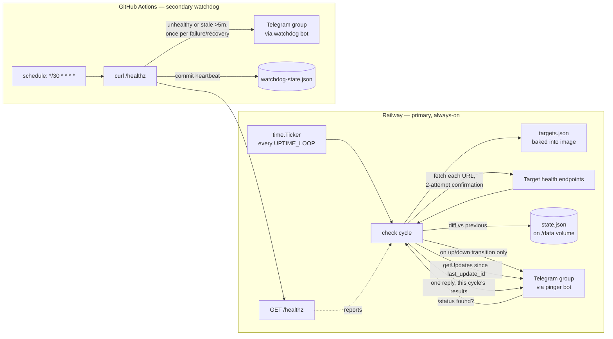
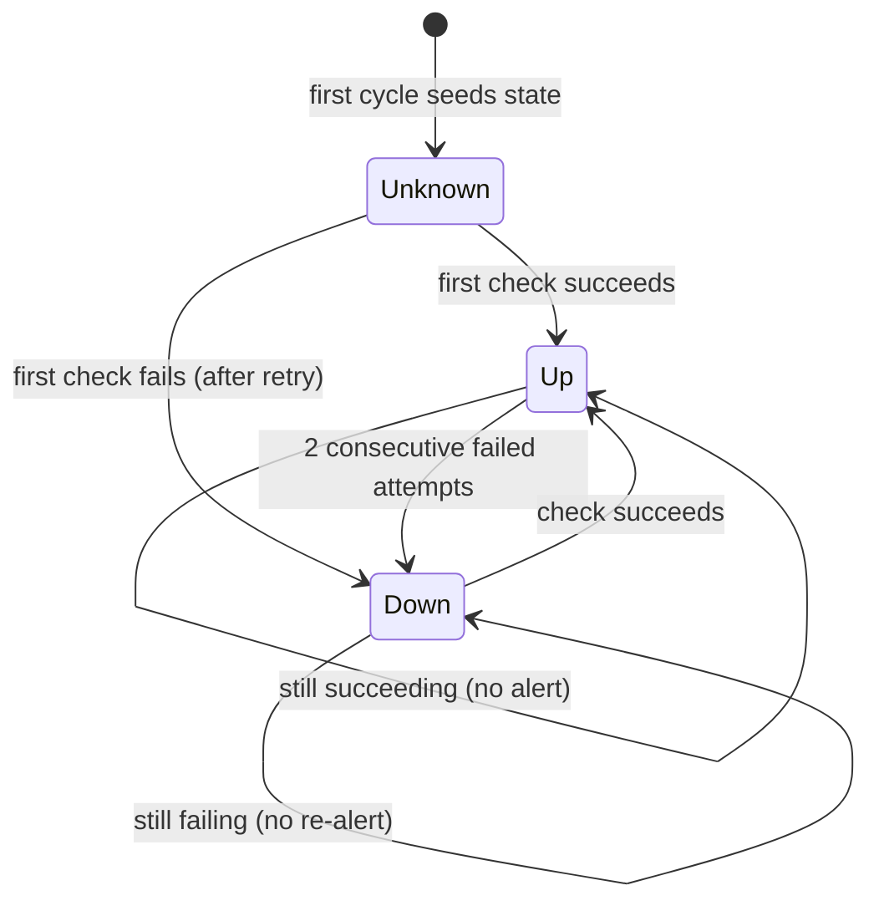

# Architecture

Module boundary follows `.agents/skills/codebase-design`: `main.go` is a
single deep module (small public surface — read targets, check, send,
persist) rather than split into packages the tool is too small to need.

Two independent layers, on purpose (see `docs/003-approach-review.md`'s
revision note for why GitHub cron was demoted from primary to watchdog):

## Flow



The pinger runs as a single always-on Railway service (Dockerfile,
`golang:1.26-alpine` build stage / `gcr.io/distroless/static` runtime).
`targets.json` is copied into the image at build time — editing it
requires a redeploy (`railway up`), not just a git push. `state.json`
lives on a Railway volume mounted at `/data` (`STATE_PATH=/data/state.json`),
so it survives redeploys but is never committed to git.

The GitHub watchdog workflow does not run Docker or Go at all — it's
bash + curl + jq polling the Railway service's public `/healthz` URL
(repo variable `PINGER_HEALTHZ_URL`). `ci.yml` (separate workflow) still
runs `go vet`/`gofmt`/`go test` on push/PR, independent of both runtime
layers.

## State machine (pinger, on Railway)

`state.json` is
`{ checked_at, last_update_id, targets: { <name>: { status, since } } }`.
Each target has a status of `up` or `down`. `checked_at` updates on
*every* cycle. `last_update_id` drives `/status` command polling — see
below.



- **2-attempt confirmation**: a target is only marked `down` after
  `checkOnce` fails, a `retryDelay` (10s) wait, and a second `checkOnce`
  also fails. This absorbs a single transient blip so it never becomes
  an alert — the core flap-avoidance mechanism.
- **Alert only on transition**: a per-target Telegram message is sent
  only when `newStatus != prev.Status`. Steady `up` or steady `down`
  across cycles is silent.
- **First sighting produces one summary message, not silence**: a
  target with no prior entry in `state.json` is seeded without a
  per-target up/down alert, but every first-seen target from a cycle is
  collected and reported in a single Telegram message
  (`formatFirstSeenSummary` in `main.go`) — never one message per
  target. If every target in the run is first-seen (a brand-new
  `state.json`), the message uses a "👋 Uptime monitoring started"
  header followed by one line per target (✅/❌ + status, with a short
  down reason e.g. `down (404)` or `down (timeout)`). If only some
  targets are first-seen (a target added later), it uses a "👋 now
  monitoring" header instead — collapsed to a single line
  (`👋 now monitoring <name> — up`) when exactly one target is new.
- **`UPTIME_RESET`**: when this env var is set (non-empty), a run
  ignores any existing `state.json` and treats every target as
  first-seen, so the summary message can be re-sent on demand. Local/
  manual use only now (the old GitHub `workflow_dispatch` reset input
  was removed with the primary-cron path).
- **`Since` drives duration**: preserved across unchanged cycles, reset
  only on a transition; used to compute the "back UP after Nm/Nh/Nd"
  message.

## Loop mode (`UPTIME_LOOP`)

Empty (default) = one-shot: run one cycle and exit 0 — used for local
dry-runs. Set (e.g. `60s`) = loop mode, used on Railway:

- Runs the check cycle immediately, then every `UPTIME_LOOP` tick
  (`time.Ticker`).
- **Never overlaps**: a `cycleGuard` (an `atomic.Bool` CompareAndSwap)
  skips a tick if the previous cycle hasn't finished, logging to
  stderr rather than running two cycles concurrently against the same
  `state.json`.
- Serves `GET /healthz` on `PORT` (default `8080`) the whole time,
  backed by a small mutex-guarded `healthStatus` struct updated after
  each completed cycle: `200 {"ok": true, "last_loop_at": <RFC3339>,
  "targets": {name: status}}`, or `503 {"ok": false, ...}` if
  `last_loop_at` is unset or older than 3x `UPTIME_LOOP` (`isHealthy`
  in `main.go`).
- Handles `SIGTERM`/`SIGINT` via `signal.NotifyContext`: the loop stops
  after its current tick, then the HTTP server gets a 5s graceful
  shutdown — matters for Railway's deploy/restart cycle not to kill a
  check mid-flight.

## `/status` command polling

Checked every loop cycle now (no cron lag) — a reply lags the actual
`/status` message by at most `UPTIME_LOOP` (e.g. 60s), down from the
old ~5-minute GitHub cron cadence.

- **After the health checks**, if both Telegram env vars are set, the
  cycle calls `getUpdates` with `offset = last_update_id + 1`,
  `timeout=0` (no long-polling — each cycle is a single pass, not a
  blocking listener), `limit=100`, and `allowed_updates=["message"]`.
- It scans the returned updates for messages in `TELEGRAM_CHAT_ID` whose
  text starts with `/status` (also matches `/status@primosa_uptime_bot`,
  which Telegram appends in groups with multiple bots).
- If at least one match is found, it replies **once**, to the latest
  matching message (`reply_to_message_id`), with a business-level status
  line per target from `targets.json` built from this cycle's fresh
  results — never a stale/cached status:
  ```
  📊 Status — 2026-09-16 18:40 UTC
  ✅ Wavly (staging) — up · 212 ms · up for 3h 12m
  ❌ Wavly — down (404) · down for 1h 05m
  ❌ Unsub — down (timeout) · down for 1h 05m
  ```
  Response time (`212 ms`) is measured around the HTTP call in
  `checkOnce` and shown only on `up` lines; it's kept in-memory for this
  cycle's reply only, not added to `state.json`. The "up for"/"down for"
  duration comes from the same `since` state.json already tracks for
  transitions, just formatted with minutes (`formatDurationHM`) instead
  of the coarser day/hour rounding used for transition alerts.
- **`last_update_id` always advances**, even when no `/status` command
  was found in the batch — otherwise old messages would be re-answered
  every cycle. It only moves forward (to the highest `update_id` seen),
  never resets.
- If `TELEGRAM_BOT_TOKEN`/`TELEGRAM_CHAT_ID` aren't set, polling is
  skipped entirely (consistent with the rest of the tool's dry-run
  behavior — nothing is printed for this feature in dry-run).
- **Telegram privacy mode**: a freshly created bot may not see the
  `/status` message at all if BotFather's group privacy mode is left
  enabled. See the README's BotFather setup step — disable
  `/setprivacy` for the bot, or make it a group admin.

## Watchdog (`.github/workflows/watchdog.yml`)

Bash + curl + jq only, no Docker/Go. Every 30 minutes:

1. `curl -fsS --max-time 20 "$PINGER_HEALTHZ_URL"`.
2. On curl failure, `ok: false`, or `last_loop_at` older than 5 minutes:
   treated as a failure.
3. `watchdog-state.json` (committed to the repo — `state.json` itself is
   now gitignored, since the pinger's state lives on the Railway volume)
   tracks `status: "ok"|"failing"` plus a `last_checked` heartbeat. A
   Telegram message (via the separate `WATCHDOG_BOT_TOKEN` bot) is sent
   only on the `ok`→`failing` and `failing`→`ok` transitions — same
   anti-flap philosophy as the pinger itself, so a multi-hour Railway
   outage produces one alert, not one every 30 minutes.
4. The commit keeps this workflow "active" for GitHub's 60-day
   auto-disable rule, same reasoning as the old `state.json` heartbeat.
