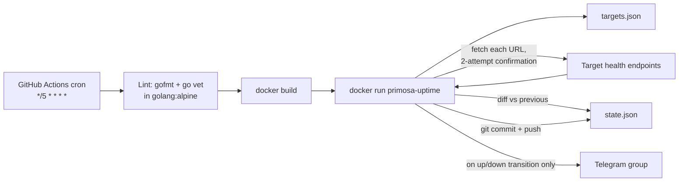
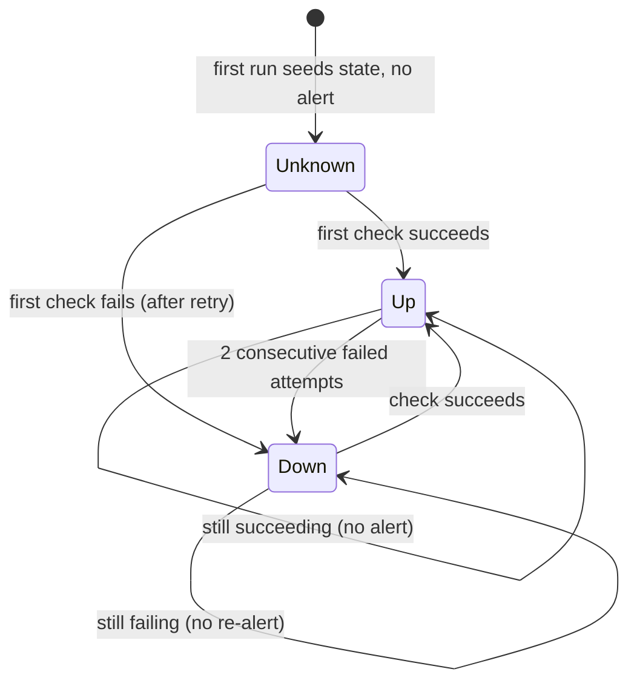

# Architecture

Module boundary follows `.agents/skills/codebase-design`: `main.go` is a
single deep module (small public surface — read targets, check, send,
persist) rather than split into packages the tool is too small to need.

## Flow

The workflow builds a Docker image (`golang:1.26-alpine` build stage,
`gcr.io/distroless/static` runtime) and runs it with the working
directory bind-mounted to `/data`, so `targets.json` is read and
`state.json` is written back to the checked-out repo, not baked into the
image. `state.json` is then committed back to the repo each run — this
both persists the last-known status per target and keeps the repo
"active" so GitHub doesn't auto-disable the scheduled workflow after 60
days of inactivity.

## State machine

`state.json` is `{ checked_at, targets: { <name>: { status, since } } }`.
Each target has a status of `up` or `down`. `checked_at` updates on
*every* run regardless of whether any target transitioned — see
"heartbeat" below.

- **2-attempt confirmation**: a target is only marked `down` after
  `checkOnce` fails, a `retryDelay` (10s) wait, and a second `checkOnce`
  also fails. This absorbs a single transient blip so it never becomes
  an alert — the core flap-avoidance mechanism.
- **Alert only on transition**: a Telegram message is sent only when
  `newStatus != prev.Status`. Steady `up` or steady `down` across runs
  is silent.
- **First sighting is silent**: a target with no prior entry in
  `state.json` gets seeded without an alert, so adding a target never
  itself produces a message.
- **`Since` drives duration**: preserved across unchanged polls, reset
  only on a transition; used to compute the "back UP after Nm/Nh/Nd"
  message.
- **Heartbeat (`checked_at`)**: without a field that changes on every
  run, a repo whose targets stay steady never produces a diff, so the
  workflow's "commit if changed" step never commits — after 60 days of
  that, GitHub auto-disables the schedule even though it's running fine.
  `checked_at` guarantees a commit (hence "repo activity") on every run.
  See `docs/003-approach-review.md`.
