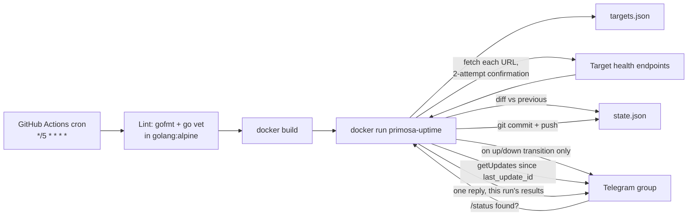
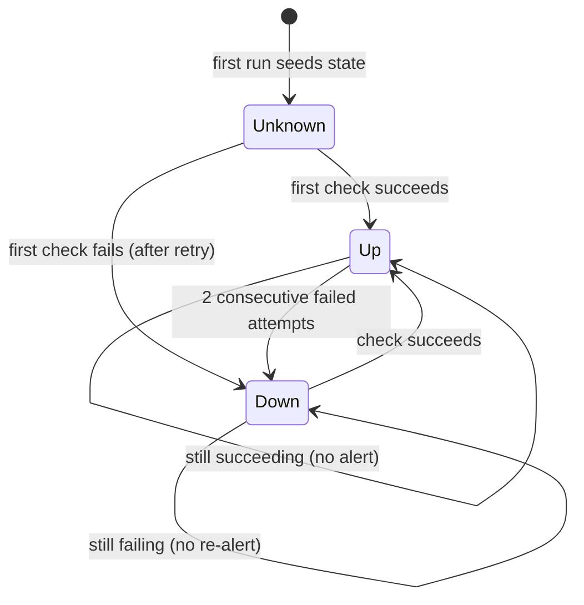

# Architecture

Module boundary follows `.agents/skills/codebase-design`: `main.go` is a
single deep module (small public surface — read targets, check, send,
persist) rather than split into packages the tool is too small to need.

## Flow



The workflow builds a Docker image (`golang:1.26-alpine` build stage,
`gcr.io/distroless/static` runtime) and runs it with the working
directory bind-mounted to `/data`, so `targets.json` is read and
`state.json` is written back to the checked-out repo, not baked into the
image. `state.json` is then committed back to the repo each run — this
both persists the last-known status per target and keeps the repo
"active" so GitHub doesn't auto-disable the scheduled workflow after 60
days of inactivity.

## State machine

`state.json` is
`{ checked_at, last_update_id, targets: { <name>: { status, since } } }`.
Each target has a status of `up` or `down`. `checked_at` updates on
*every* run regardless of whether any target transitioned — see
"heartbeat" below. `last_update_id` drives `/status` command polling —
see below.



- **2-attempt confirmation**: a target is only marked `down` after
  `checkOnce` fails, a `retryDelay` (10s) wait, and a second `checkOnce`
  also fails. This absorbs a single transient blip so it never becomes
  an alert — the core flap-avoidance mechanism.
- **Alert only on transition**: a per-target Telegram message is sent
  only when `newStatus != prev.Status`. Steady `up` or steady `down`
  across runs is silent.
- **First sighting produces one summary message, not silence**: a
  target with no prior entry in `state.json` is seeded without a
  per-target up/down alert, but every first-seen target from a run is
  collected and reported in a single Telegram message
  (`formatFirstSeenSummary` in `main.go`) — never one message per
  target. If every target in the run is first-seen (a brand-new
  `state.json`), the message uses a "👋 Uptime monitoring started"
  header followed by one line per target (✅/❌ + status, with a short
  down reason e.g. `down (404)` or `down (timeout)`). If only some
  targets are first-seen (a target added later), it uses a "👋 now
  monitoring" header instead — collapsed to a single line
  (`👋 now monitoring <name> — up`) when exactly one target is new.
- **`UPTIME_RESET`**: when this env var is set (non-empty), the run
  ignores any existing `state.json` and treats every target as
  first-seen, so the summary message can be re-sent on demand. Set via
  the `reset` boolean input on the `workflow_dispatch` trigger, which
  the workflow only passes through to `docker run` as
  `-e UPTIME_RESET=1` when true — scheduled runs never set it.
- **`Since` drives duration**: preserved across unchanged polls, reset
  only on a transition; used to compute the "back UP after Nm/Nh/Nd"
  message.
- **Heartbeat (`checked_at`)**: without a field that changes on every
  run, a repo whose targets stay steady never produces a diff, so the
  workflow's "commit if changed" step never commits — after 60 days of
  that, GitHub auto-disables the schedule even though it's running fine.
  `checked_at` guarantees a commit (hence "repo activity") on every run.
  See `docs/003-approach-review.md`.

## `/status` command polling

There is no always-on process listening for Telegram messages — the
existing 5-minute cron run doubles as the poller, so a reply lags the
actual `/status` message by up to 5 minutes (the cron cadence).

- **After the health checks**, if both Telegram env vars are set, the
  run calls `getUpdates` with `offset = last_update_id + 1`,
  `timeout=0` (no long-polling — this is a one-shot process, not a
  server), `limit=100`, and `allowed_updates=["message"]`.
- It scans the returned updates for messages in `TELEGRAM_CHAT_ID` whose
  text starts with `/status` (also matches `/status@primosa_uptime_bot`,
  which Telegram appends in groups with multiple bots).
- If at least one match is found, it replies **once**, to the latest
  matching message (`reply_to_message_id`), with a business-level status
  line per target from `targets.json` built from this run's fresh
  results — never a stale/cached status:
  ```
  📊 Status — 2026-09-16 18:40 UTC
  ✅ Proof of Life (staging) — up · 212 ms · up for 3h 12m
  ❌ Proof of Life — down (404) · down for 1h 05m
  ❌ Unsub — down (timeout) · down for 1h 05m
  ```
  Response time (`212 ms`) is measured around the HTTP call in
  `checkOnce` and shown only on `up` lines; it's kept in-memory for this
  run's reply only, not added to `state.json`. The "up for"/"down for"
  duration comes from the same `since` state.json already tracks for
  transitions, just formatted with minutes (`formatDurationHM`) instead
  of the coarser day/hour rounding used for transition alerts.
- **`last_update_id` always advances**, even when no `/status` command
  was found in the batch — otherwise old messages would be re-answered
  every run. It only moves forward (to the highest `update_id` seen),
  never resets.
- If `TELEGRAM_BOT_TOKEN`/`TELEGRAM_CHAT_ID` aren't set, polling is
  skipped entirely (consistent with the rest of the tool's dry-run
  behavior — nothing is printed for this feature in dry-run).
- **Telegram privacy mode**: a freshly created bot may not see the
  `/status` message at all if BotFather's group privacy mode is left
  enabled. See the README's BotFather setup step — disable
  `/setprivacy` for the bot, or make it a group admin.
